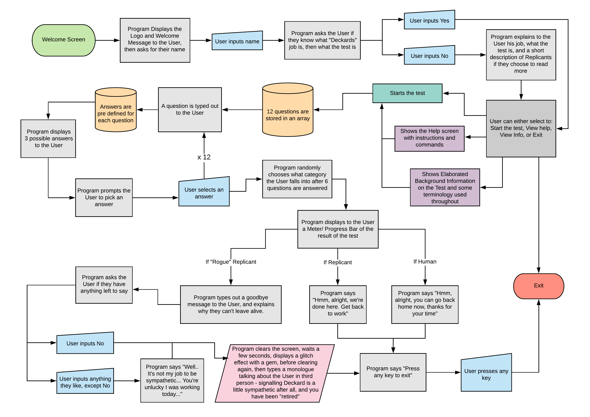

## Outline
**Do Devs Dream of Electric Sheep?** is a terminal text game that is a rendition of the Voight-Kampff test, from the 1982 film *Blade Runner*. The interviewer Deckard, main charcter of the film, asks a series of seemingly odd questions trying to discover if the User is a Human, Replicant or a "Rogue" Replicant, and *retires* them if they are the latter.
  It is built in Ruby to explore Modularisation, DRY principles, Ruby Gems and Error Handling as well as learning how to properly plan, structure and create a project utilising product management tools.

Disclaimer: Please don't take this test too seriously. I am providing an example of how impossible it might be to define a human or a replicant, based off a small program.

# Background Information
In the dystopian world of Ridley Scott's 1982 film Blade Runner, and its loosely based insipiration, "Do Androids Dream of Electric Sheep?" the novel by Philip K. Dick, you're either a Human or a genetically engineered being called a Replicant - mostly used for dangerous and degrading work like slave labour. Sometimes these Replicants go "rogue", so it becomes the job of a special police unit - Blade Runners - to hunt down and *retire* (assassinate) those Replicants.

However both Humans and Replicants are almost identical physically, the only way to differenciate the two is with an empathy test, a series of questions trying to provoke an emotional repsonse from the user, known as Voight-Kampff, introduced in the opening scene of Blade Runner.
 You can read more about the Voight-Kampff test [here](https://bladerunner.fandom.com/wiki/Voight-Kampff_test) if you're interested.

# Description, Purpose and Motivation
**Do Devs Dream of Electric Sheep?** opens on a welcome screen that displays the logo, followed by a few introduction questions from the "interviewer" Deckard, before allowing the User to:
- Start the test
- View Help (controls and how the test is going to work)
- View Info (background information regarding the lore of Voight Kampff, Blade Runner and Deckard)
- Exit the program

When starting the test, the program loops through 12 questions, one at a time, and then displays to the User the 3 pre-defined answers for the particular question.

The User then inputs a number to pick the answer they want, then followed by the next question.

Once all 12 questions are asked, the program randomly chooses which ending the User got, and displays a short unique message for each. If your ending is either Human or Replicant, thats the end of the test, and you're followed by the screen clearing, prompting you to press "any key" to return to the exit the program.

If your ending is "Rogue" Replicant, theres a few more questions asked to the User, before the screen clears, then a random assortment of letters, numbers and symbols are displayed on the screen signalling you have been retired.
 Shortly after the screen clears again, you see Deckard typing out a monologue talking about the User in third person, giving the indication he was a little sympathetic and found it harder than he thought to get his job done.
 Once finished, the user is prompted to press "any key" to exit the program.

This program is purely for enjoyment, based off something I appreciate, and can share with friends who also are fans of the film. Whilest also challenging myself to apply everything I have learnt so far in 4-5 weeks at [Coder Academy](https://coderacademy.edu.au/about-coder-academy).
 
It is mainly targeted towards those who are fans of the original Blade Runner flim and Sci-Fi in general, those who enjoy text based games with multiple endings, whilest also anyone like myself trying to better understand the fundamentals of programming and object-oriented programming with Ruby.

I re-watched both the orginal Blade Runner, and Blade Runner 2049 (for the maybe 10th time each now?) the night before we got the assignment, and the idea clicked right away. So I never really explored any other ideas that I wanted to create.

I was a bit concerned at the beginning that maybe this project would be out of my scope of learning at this point in time, as the idea behind it is slightly complex and not something straight forward that could be easily implemented in code, however I was reassured by my educators not to go crazy trying to implement everything exactly the way I wanted, exactly how it is in the film, so some features that I couldn't fit into the time frame of the assignment, are planned for the future. I will be working on them in the weeks and months after in my own time to "finish" the program to my liking.

# UI/UX

## User Story (as of right now)
- User is presented an indtroduction screen and a few questions
- User can;
  - Start the test, View Help, View Info, Exit the program.
- A question get typed out to the User
- 3 pre-defined answers are displayed, followed by the program prompting the User to input a corresponding number to an answer
- 12 questions get asked in total
- The program randomly chooses if the User is a 
  - Human, Replicant, "Rogue" Replicant.
- A Meter/ Progress Bar is displayed showing something like [Human --x------------ Replicant --- "Rogue"] where x is the User
- The test ends and the User is prompted to exit the program

  OR

- The User is *retired* if they get the "Rogue" Replicant ending, followed by being prompted to exit the program

If the User inputs something incorrectly for an answer, Deckard will prompt the User to take the test seriously and answer the first thing that comes to mind.

# Functionality
*Do Devs Dream of Electric Sheep?* is a terminal text game where the user selects a pre defined input in response to the programs question. Once answered all 6 questions, the 

The game begins with an ASCII title, then the game asks the user to relax, if they're ready to begin, and then follows by asking a series of seemingly odd questions, that are meant to determine if the user is a human or replicant, based off their responses.

## Current Features
-  After a introduction message, User has acces to 
	- Starting the test
	- Viewing Help (Controls and how the test will work)
	- Viewing Information regarding the inspiration behind the game (Blade Runner franchise, Voight Kampff, etc)
	- Exit the program
- Saving user input for later use
- A Method to print out each question from an array
- A Method that gets the 3 pre-defined answers for each question that are stored in an array
- A Method that randomly select what ending the User gets
- ASCII art for the Welcome screen, and end-of-test screen
- A glitch effect that only displays if the User is a "Rogue" Replicant, resulting in their *retirement*

## Possible Features
- A timer that starts when the answers are displayed, till the User selects one, which results in;
  - Finding a way to calculate the result of the test, dependant on each answer and how the User answered
- A different ASCII logo at the end of the game dependant on each outcome of the test
- Sound bytes during the glitch effect
- Possibly implementing this as a web app with a video/ gif playing in the background.

## Gems Used

Colorize - used throughout the program.

TTY-ProgressBar - used in one of the unique endings.

TTY-Spinner - used at the start of the program, and in one of the unique endings.

# Control Flow Design and Implementation
The main jist of my application is for Deckard to ask a series of multiple choice questions to the User. They are intended to be "emotionally provoking" (at least in the film), however due to time constraints I won't be able to implement a way to calculate the Users ending dependant on how the answered, so for now, the program randomly chooses one of the three endings;
- if you're a human, you get told to go back home
- if you're a replicant, you get told to get back to work
- if you're a "rogue" replicant, you get *retired*

# Planning Process
This wasn't my first time using Trello, however it was the first time for using it to plan a complete project.

The Lists were pretty easy to follow, and it ddefinitely helped in having a visual representation of each task I needed to accomplish.

# Testing
Two tests or "examples" using RSpec. First one checks to see if the pre_test_msg method returns the string "Alright, I'm going to ask you a series of questions, just relax and answer them as simply as you can." before looping the questions. The second checks to see if the test_loop method loops through the array of questions.

 

Another example that checks to see if the method user_ending prints out a random ending to the User, and then returns returns true if it passes, else it returns false

# Development Log

<a href="docs/development-log.md">development-log.md</a>

## Sources
Information and text excerpts used for Info Menu, Questions from the Test etc:

https://bladerunner.fandom.com/wiki/Voight-Kampff_test

https://www.urbandictionary.com/define.php?term=Voight-Kampff%20machine

https://en.wikipedia.org/wiki/Blade_Runner_(franchise)

https://en.wikipedia.org/wiki/Blade_Runner

https://en.wikipedia.org/wiki/Do_Androids_Dream_of_Electric_Sheep%3F
